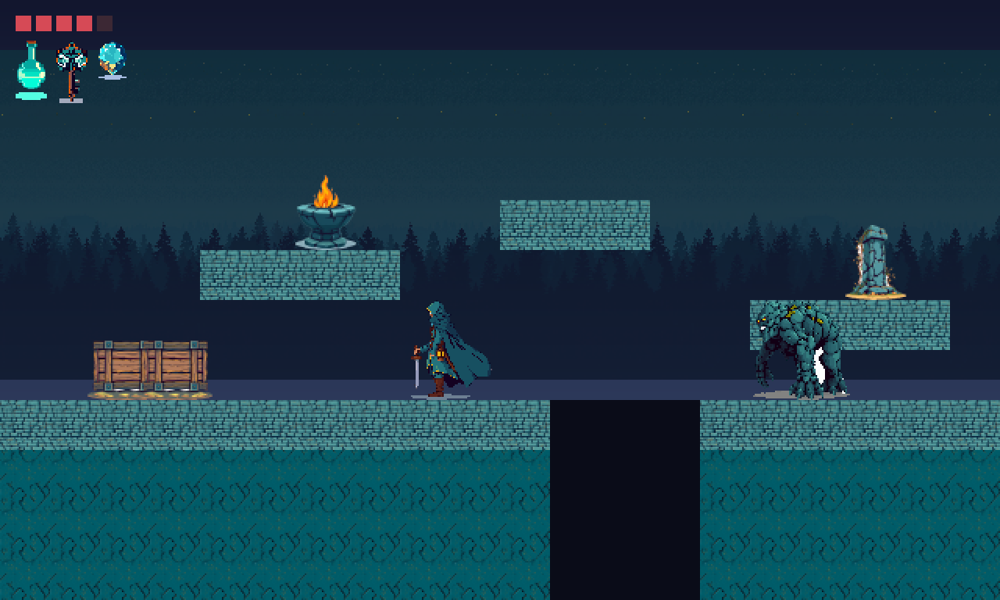

# AssetForge

A local, offline pipeline for generating 2D game assets: sprites, tilesets,
icons, characters, sound effects and music. Everything runs on your own GPU.
Nothing is sent anywhere.

Two engines share one repository:

- **Image** drives ComfyUI headlessly across Flux Schnell, SDXL and SD 1.5, then
  post-processes renders into real pixel art with correct grids and palettes.
- **Audio** drives Meta's AudioCraft (MusicGen and AudioGen), then post-processes
  raw output into trimmed, level-matched, seamlessly looping game audio.

The generation half is the easy half. Most of what is here is post-processing,
because a raw diffusion render is a *picture of* a sprite and a raw AudioCraft
clip is a *recording that resembles* a sound effect. Turning either into an
asset an engine can use is the work.

## Requirements

- NVIDIA GPU (developed on a 16GB RTX 4060 Ti)
- Windows, Python 3.11 for the audio engine
- About 40GB of disk for models

## Install

Neither engine's runtime is in git. **[docs/SETUP.md](docs/SETUP.md) walks
through both from a fresh clone**, including the exact dependency pins the audio
engine needs and a troubleshooting table.

Short version, once installed:

```bash
python engines/image/scripts/download_models.py --all
cd engines/image && ./python_embeded/python.exe -s ComfyUI/main.py --windows-standalone-build --listen 127.0.0.1 --port 8188
```

Then, from the repository root:

```bash
python engines/image/scripts/asset_presets.py --preset item_icon --subject "a red health potion" --output out/image/potion.png
```

For audio, use the audio engine's own virtualenv, which pins an older torch than
the image engine:

```bash
./engines/audio/venv/Scripts/python.exe engines/audio/scripts/audio_presets.py --preset sword_hit --output out/audio/sword.wav
```

Both `asset_presets.py` and `audio_presets.py` take `--list`.

## What it produces

| Asset | Command |
|---|---|
| Item icon, true 32px indexed art | `asset_presets.py --preset item_icon` |
| Side-on character sprite | `asset_presets.py --preset character` |
| Seamless terrain tile | `asset_presets.py --preset topdown_tile` |
| A full tileset | `gen_tileset.py` then `make_tiles.py` |
| A composed map | `build_village.py` |
| Engine-ready terrain transitions | `autotile.py` (47-tile blob atlas + JSON) |
| Normal maps for 2D lighting | `make_normalmap.py` |
| Sound effect | `audio_presets.py --preset sword_hit` |
| Looping music track | `audio_presets.py --preset town_theme` |

## Demo

[demos/moonlit_ruins](demos/moonlit_ruins) is a complete vertical-slice pack for
a platformer: 11 images, 10 audio files, and a scene composed from them. Nothing
in it was drawn, recorded or edited by hand.



## Documentation

- [docs/SETUP.md](docs/SETUP.md) — install both engines, and troubleshooting
- [docs/RECIPES.md](docs/RECIPES.md) — worked end-to-end workflows
- [docs/IMAGE.md](docs/IMAGE.md) — image engine, post-processing, tilesets
- [docs/AUDIO.md](docs/AUDIO.md) — audio engine, looping, game audio conventions
- [docs/MODELS.md](docs/MODELS.md) — every model, when to use which, measured comparisons
- [docs/FINDINGS.md](docs/FINDINGS.md) — what was measured, and what was tried and rejected
- [CLAUDE.md](CLAUDE.md) — condensed decision rules for an agent driving these tools

`docs/FINDINGS.md` is the one to read before changing anything. Several obvious
improvements were tested here and measured to be neutral or harmful, and the
reasons are specific to this stack rather than general.

## Layout

```
engines/
  image/
    ComfyUI/          runtime (not in git)
    python_embeded/   runtime (not in git)
    workflows/        one ComfyUI API workflow per model
    models.py         image model registry
    scripts/          generation and post-processing
  audio/
    venv/             runtime (not in git)
    scripts/          generation and post-processing
out/                  generated assets (not in git)
vendor/               third-party sources, see licences below
docs/
```

## Licences and attribution

The pixel-art grid snapper in `engines/image/scripts/pixel_art_processor.py` is
vendored from [doriansao/codex-pixel-art-generator](https://github.com/doriansao/codex-pixel-art-generator)
(MIT), itself a port of Hugo Duprez's
[spritefusion-pixel-snapper](https://github.com/Hugo-Dz/spritefusion-pixel-snapper) (MIT).

Model weights are downloaded from Hugging Face under their own licences, which
differ. FLUX.1-schnell is Apache 2.0, SDXL is CreativeML Open RAIL++-M, and
AudioCraft's weights are CC-BY-NC 4.0, which is **non-commercial**. Check the
licence of any model before shipping what it generates.
